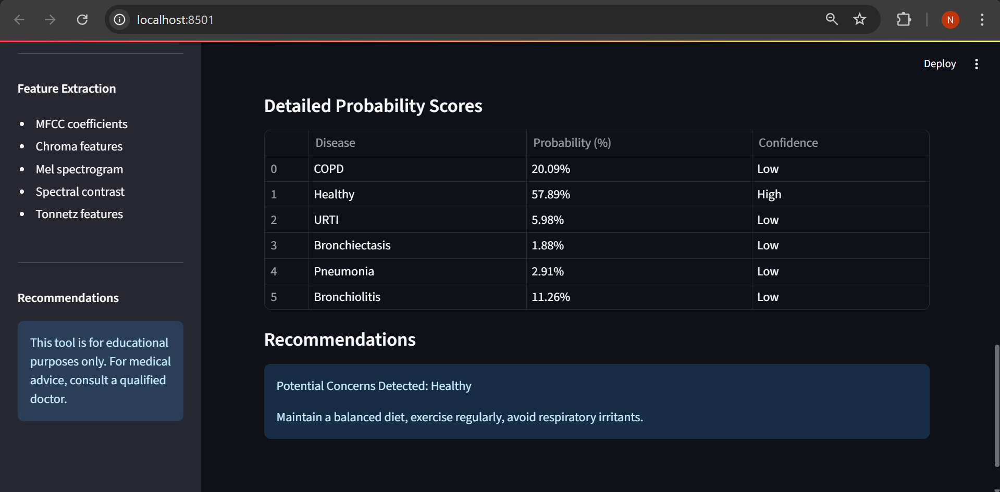

# Respiratory Disease Prediction System

An end-to-end AI project for lung disease prediction using respiratory sound recordings and a hybrid CNN+LSTM deep learning model. This repository covers everything from environment setup, data preparation, model training, to deploying a modern Streamlit web app for real-time predictions.

---

## Project Setup
1. **Clone the repository**
	```bash
	git clone <your-repo-url>
	cd Lung-Sound-Classification
	```

2. **Install dependencies**
	```bash
	pip install streamlit librosa tensorflow matplotlib numpy pandas scikit-learn seaborn
	```

3. **Dataset**
	- Place the extracted respiratory sound dataset in the `extracted_dataset/` folder as shown in the workspace structure.
	- Ensure `patient_diagnosis.csv` and audio files are present.

4. **Model File**
	- After training, saving your model as `final_model.h5` in the project root.

---

## Environment & Imports
All code is written in Python. Key libraries used:
- `numpy`, `pandas` for data handling
- `librosa` for audio feature extraction
- `matplotlib`, `seaborn` for visualization
- `tensorflow.keras` for deep learning (CNN, LSTM)
- `scikit-learn` for preprocessing, metrics, and cross-validation
- `streamlit` for the web interface

---

## Data Preparation & Feature Extraction
1. **Read and organize patient diagnosis and audio files**
2. **Extract features** from each audio file:
	- MFCC coefficients
	- Chroma features
	- Mel spectrogram
	- Spectral contrast
	- Tonnetz features
3. **Data augmentation** for minority classes to balance the dataset
4. **Label encoding** for disease classes

---

## Model Architecture & Training
1. **CNN+LSTM Hybrid Model**
	- 1D CNN layers for feature extraction
	- LSTM layer for temporal pattern learning
	- Dense layers for classification
2. **Training**
	- K-Fold cross-validation for robust evaluation
	- Early stopping, learning rate reduction, and model checkpointing
	- Class weights to handle imbalance
3. **Final Model**
	- Train on the entire dataset
	- Save as `final_model.h5`

---

## Results
- Accuracy: **91%**
- F1-Score: **0.90**
- Precision: **0.89**
- Recall: **0.92**


## 🌐 Streamlit Web App
1. **Modern UI** with sidebar navigation and clear sections 
2. **Upload audio** (WAV, MP3, M4A) 
3. **Audio playback** and feature visualizations
4. **Prediction results**
	- Primary disease prediction
	- Confidence score
	- Probability distribution (bar chart & table)
	- Disease info and actionable recommendations
	
	
5. **Medical disclaimer** and educational purpose note

---

## How to Run
1. Start the app:
	```bash
	streamlit run lung_disease_predictor.py
	```
2. Open the provided local URL in your browser
3. Upload a lung sound file and view predictions

---

## Project Structure
- `lung_disease_predictor.py` : Streamlit web app
- `final_model.h5` : Trained CNN+LSTM model
- `extracted_dataset/` : Respiratory sound dataset
- `style.css` : Optional custom styles
- `README.md` : Project documentation

---

## Medical Disclaimer
This tool is for educational purposes only. It does not provide medical advice, diagnosis, or treatment. For more information or concerns, please consult a qualified doctor.

---

## Author
Developed by **Naman Saxena**

---

## Contact
For questions or feedback, please reach out via GitHub.
